# Low-Level Design — eks-hub-spoke

This document describes the internal architecture of the eks-hub-spoke platform: how the AWS accounts relate to each other, how Terraform state and providers flow between workspaces, how the network is wired together, how ArgoCD delivers workloads to the spoke clusters, how EMR on EKS and JupyterHub ingest and process data, how MSK Kafka captures Spark output, how Amazon MQ bridges Kafka topics to downstream consumers across all four accounts, how the prod-data account stores processed data in OpenSearch/Aurora/Neptune, and the end-to-end data flow spanning all AWS components.

---

## Table of Contents

1. [AWS Account Hierarchy](#1-aws-account-hierarchy)
2. [Terraform Workspace & State Flow](#2-terraform-workspace--state-flow)
3. [Cross-Account Provider Wiring](#3-cross-account-provider-wiring)
4. [Network Topology](#4-network-topology)
5. [Transit Gateway Routing](#5-transit-gateway-routing)
6. [ArgoCD GitOps Flow](#6-argocd-gitops-flow)
7. [Startup Sequence](#7-startup-sequence)
8. [EMR on EKS — Pod Identity & S3 Landing Zone](#8-emr-on-eks--pod-identity--s3-landing-zone)
9. [Amazon MQ — Kafka-to-Message-Broker Bridge](#9-amazon-mq--kafka-to-message-broker-bridge)
10. [End-to-End Data Flow](#10-end-to-end-data-flow)
11. [Prod-Data — Isolated Analytics Store](#11-prod-data--isolated-analytics-store)

---

## 1. AWS Account Hierarchy

The management account owns the AWS Organizations root. Four member accounts are provisioned by Terraform — one per cluster. The `OrganizationAccountAccessRole` is created automatically by Organizations in every new member account and is the single mechanism used for all cross-account access.

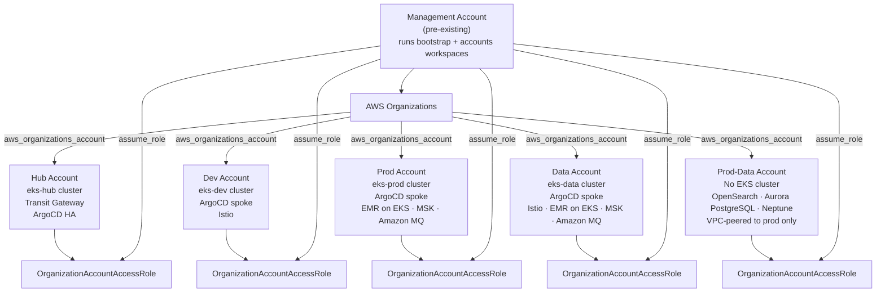

---

## 2. Terraform Workspace & State Flow

All workspaces share a single S3 bucket (in the management account) for remote state. The hub workspace reads dev, prod, and data state to obtain VPC and subnet IDs needed by the Transit Gateway module and to register the spoke clusters in ArgoCD.

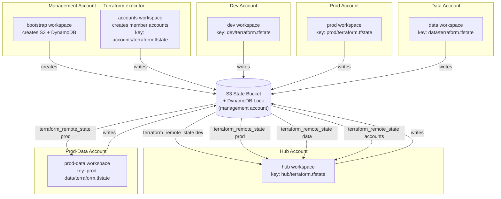

### Remote state outputs consumed by hub

| Source workspace | Outputs read by hub |
|---|---|
| `dev` | `vpc_id`, `vpc_cidr`, `private_subnet_ids`, `private_route_table_ids`, `cluster_security_group_id`, `cluster_endpoint`, `cluster_certificate_authority_data`, `argocd_manager_token` |
| `prod` | same set as dev + `emr_virtual_cluster_id`, `emr_job_execution_role_arn`, `emr_landing_zone_bucket_name`, `emr_landing_zone_bucket_arn` |
| `data` | same set as prod |
| `accounts` | reference only (account IDs come from `var.*_account_id`) |

---

## 3. Cross-Account Provider Wiring

The hub workspace declares five AWS provider instances. The default (unaliased) provider and `aws.hub` both assume a role in the hub account — the default is used by all existing hub resources (VPC, EKS, IAM, ArgoCD), while `aws.hub` is passed explicitly into the transit-gateway module. `aws.dev`, `aws.prod`, and `aws.data` create resources directly inside the spoke accounts without requiring any Terraform code in those workspaces.

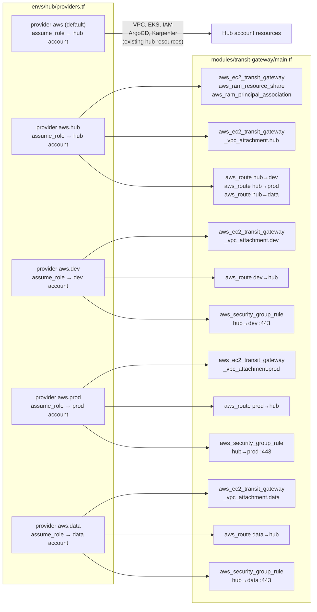

---

## 4. Network Topology

The Transit Gateway lives in the hub account and is shared to the spoke accounts via AWS Resource Access Manager (RAM). Each account attaches its private subnets to the TGW. `auto_accept_shared_attachments = enable` removes the need for a manual acceptance step in the spoke accounts.

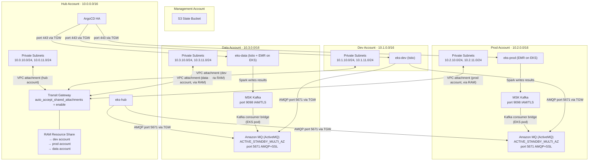

---

## 5. Transit Gateway Routing

Nine route entries and three security group rules are created by the hub workspace using aliased providers.

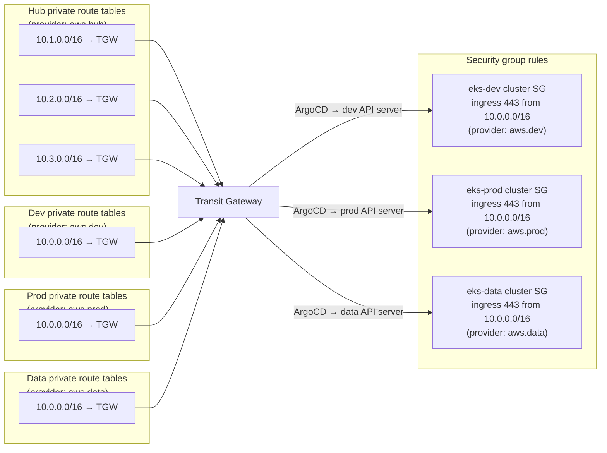

### RAM share propagation

A `time_sleep` of 30 s is inserted between the RAM principal associations and the cross-account VPC attachments. RAM is eventually consistent — without this delay the spoke accounts would not yet see the TGW, producing a `TransitGatewayNotFound` error.

```
aws_ram_principal_association.dev
aws_ram_principal_association.prod
aws_ram_principal_association.data
        │
        │  time_sleep 30s
        ▼
aws_ec2_transit_gateway_vpc_attachment.dev  (provider: aws.dev)
aws_ec2_transit_gateway_vpc_attachment.prod (provider: aws.prod)
aws_ec2_transit_gateway_vpc_attachment.data (provider: aws.data)
```

---

## 6. ArgoCD GitOps Flow

Hub ArgoCD is configured in HA mode (2 replicas). It holds Kubernetes cluster secrets for each spoke, generated from the `argocd_manager` service account token written to the dev, prod, and data remote state.

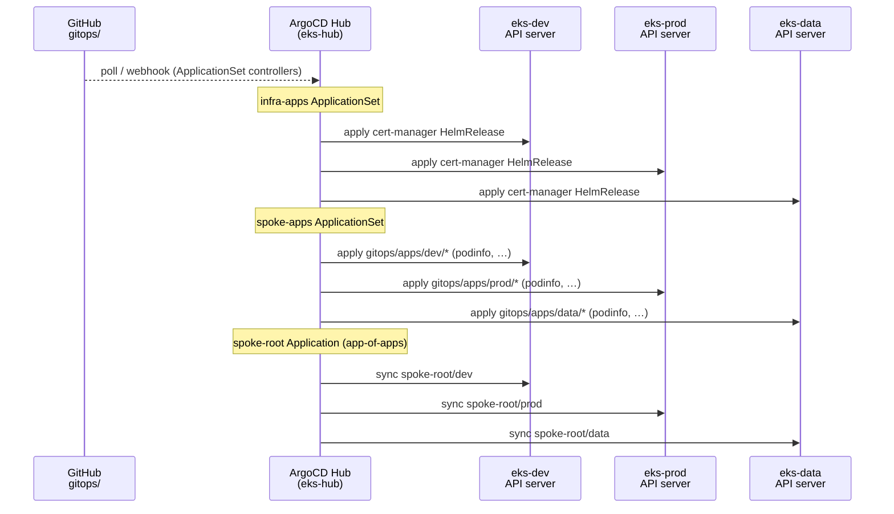

### Cluster secret data flow

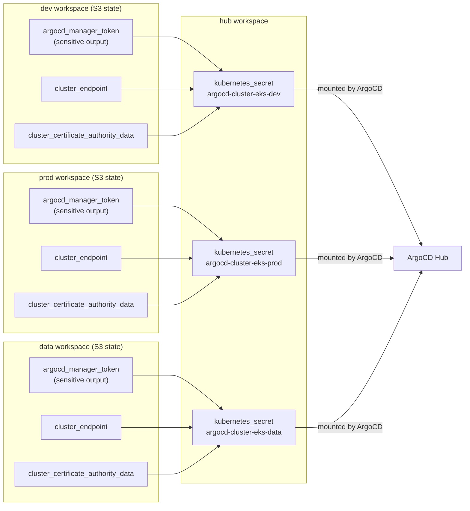

---

## 7. Startup Sequence

`startup.sh` orchestrates all workspaces in dependency order. Dev, prod, and data are applied in parallel since none depends on the others.

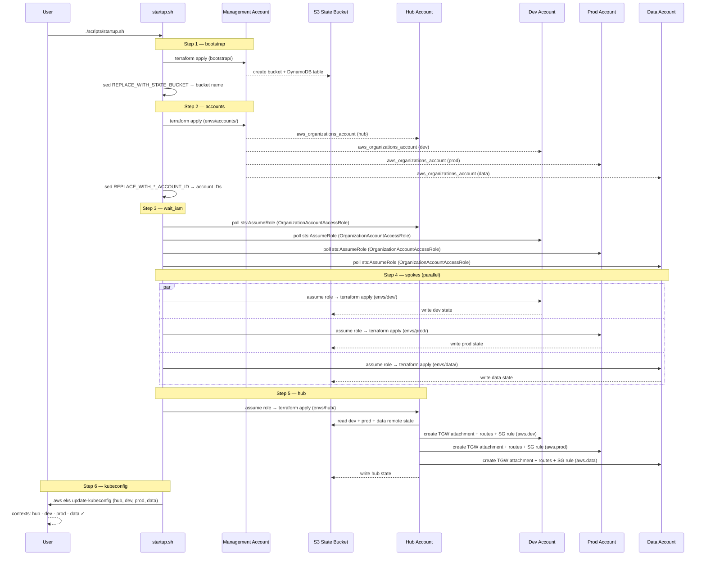

---

## 8. EMR on EKS — Pod Identity & S3 Landing Zone

### Why Pod Identity instead of IRSA

EKS Pod Identity removes the dependency on the cluster's OIDC issuer URL. The IAM role's trust policy names `pods.eks.amazonaws.com` as the trusted service; a single `aws_eks_pod_identity_association` resource then binds the role to a specific namespace + service account pair. The `eks-pod-identity-agent` DaemonSet (deployed as a standard EKS addon on every cluster) intercepts the association and injects temporary credentials into matching pods via a projected token volume — no JWKS endpoint configuration, no OIDC provider ARN, no condition keys.

### Pod Identity credential flow

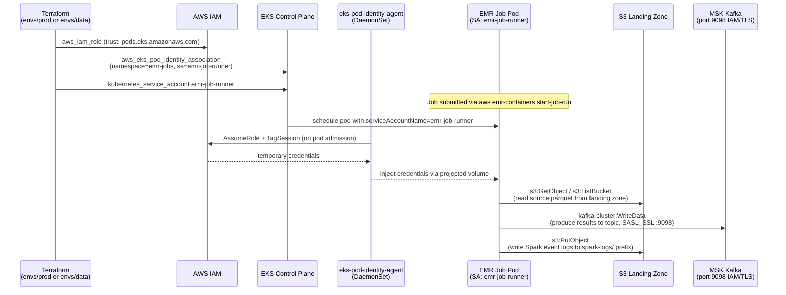

### S3 landing zone

Each EMR-enabled account (prod, data) gets a dedicated S3 bucket created by the `emr-on-eks` module alongside the virtual cluster:

| Property | Value |
|---|---|
| Name | `<cluster_name>-landing-zone-<account_id>` |
| Encryption | AES256 (SSE-S3) |
| Versioning | Enabled |
| Public access | Fully blocked (`block_public_acls`, `restrict_public_buckets`) |
| IAM scope | Job execution role has `s3:GetObject/PutObject/DeleteObject` on `arn:aws:s3:::${bucket}/*` and `s3:ListBucket` on `arn:aws:s3:::${bucket}` — no wildcard `*` |

The bucket name embeds the account ID, making it globally unique without a random suffix provider.

### Spark History Server

A `kubernetes_deployment` named `spark-history-server` is deployed in the `emr-jobs` namespace alongside the job pods. It runs the EMR Spark image (`public.ecr.aws/emr-on-eks/spark/emr-7.5.0`) with `SPARK_HISTORY_OPTS` pointing to `s3://<landing_zone>/spark-logs/`. It shares the `emr-job-runner` service account, so Pod Identity grants the same S3 read permissions used by job pods. A `ClusterIP` service exposes it on port 18080 within the cluster.

```
spark-history-server pod (emr-jobs ns)
  ├─ SA: emr-job-runner  →  Pod Identity  →  emr-job-runner IAM role
  ├─ reads:  s3://<landing-zone>/spark-logs/**  (S3 event logs written by Spark jobs)
  └─ serves: ClusterIP :18080  (kubectl port-forward or Istio VirtualService)
```

---

## 9. Amazon MQ — Kafka-to-Message-Broker Bridge

### Architecture

Amazon MQ (ActiveMQ) brokers are deployed in the **prod** and **data** accounts, co-located in the same VPCs as their MSK clusters. A lightweight Kafka consumer bridge application (a Kubernetes Deployment running in the EKS cluster) reads from MSK topics using IAM/TLS authentication and republishes messages to Amazon MQ queues and topics via AMQP (port 5671).

Because all four VPCs are connected via the Transit Gateway, clients in the **hub** and **dev** accounts can consume from Amazon MQ in prod or data over the private network — no internet exposure, no cross-account IAM policy changes required beyond the TGW routing that already exists.

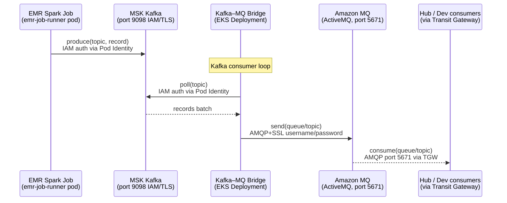

### Amazon MQ broker properties

| Property | Value |
|---|---|
| Engine | ActiveMQ `5.18.3` |
| Deployment mode | `ACTIVE_STANDBY_MULTI_AZ` — primary + standby across 2 AZs |
| Instance type | `mq.m5.large` (configurable via `mq_instance_type`) |
| Network placement | Private subnets of the prod / data VPC |
| Publicly accessible | `false` — reachable only via private IP |
| Client protocol | AMQP+SSL (port 5671) — used by all cross-account consumers |
| Java/JMS clients | OpenWire+SSL (port 61617) |
| Web console | Port 8162 (HTTPS) — restricted to local VPC CIDR only |
| Authentication | Username/password (`mq_username` / `mq_password` sensitive variable) |
| Logging | General + audit logs → CloudWatch (`/aws/amazonmq/<cluster>/general`, `.../audit`) |

### Cross-account connectivity

Amazon MQ SG allows AMQP+SSL (5671), OpenWire+SSL (61617), STOMP+SSL (61614), and MQTT+SSL (8883) from `10.0.0.0/8`, covering all four VPC CIDRs via the Transit Gateway. No additional TGW route changes are required — the existing hub↔spoke routing handles the traffic.

```
Hub    10.0.0.0/16 ──┐
Dev    10.1.0.0/16 ──┤  Transit Gateway  ──►  Amazon MQ (prod)  10.2.x.x:5671
Prod   10.2.0.0/16 ──┤                   ──►  Amazon MQ (data)  10.3.x.x:5671
Data   10.3.0.0/16 ──┘
```

### Client failover URL

For ACTIVE_STANDBY_MULTI_AZ deployments, clients should use the failover URL output by Terraform to automatically reconnect on broker failover:

```
failover:(amqp+ssl://<primary>:5671,amqp+ssl://<standby>:5671)?maxReconnectAttempts=10
```

Retrieve after apply:
```bash
terraform output -chdir=envs/prod mq_amqp_failover_url
terraform output -chdir=envs/data mq_amqp_failover_url
```

---

## 10. End-to-End Data Flow

This section traces the complete journey of data through the platform — from a data scientist opening a notebook, through EMR Spark processing, into MSK Kafka, across the Amazon MQ bridge, and finally to consumers in all four AWS accounts.

The same pipeline runs independently in both the **prod** and **data** accounts; the diagram below applies to either.

### Full pipeline sequence

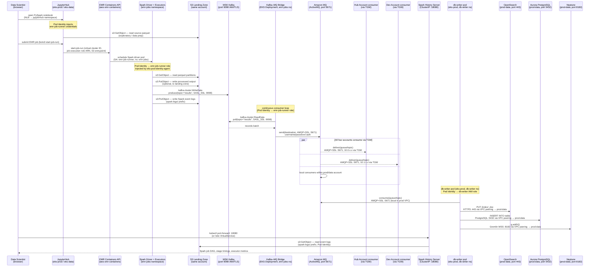

### Component inventory

| Component | Account(s) | K8s namespace | IAM credential | Outbound protocol |
|---|---|---|---|---|
| JupyterHub single-user pod | prod, data | `jupyterhub` | Pod Identity → `emr-job-runner` role | S3 (HTTPS), EMR Containers API (HTTPS) |
| Spark driver pod | prod, data | `emr-jobs` | Pod Identity → `emr-job-runner` role | S3 (HTTPS), MSK SASL_SSL :9098 |
| Spark executor pods | prod, data | `emr-jobs` | Pod Identity → `emr-job-runner` role | S3 (HTTPS), MSK SASL_SSL :9098 |
| Kafka–MQ Bridge | prod, data | `emr-jobs` | Pod Identity → `emr-job-runner` role | MSK SASL_SSL :9098 → MQ AMQP+SSL :5671 |
| Spark History Server | prod, data | `emr-jobs` | Pod Identity → `emr-job-runner` role | S3 (HTTPS read), serves :18080 |
| Amazon MQ broker | prod, data | — (managed service) | username/password | AMQP+SSL :5671, OpenWire+SSL :61617 |
| Amazon MQ consumers | hub, dev, prod, data | any | username/password | AMQP+SSL :5671 via Transit Gateway |

### IAM permissions on the shared `emr-job-runner` role

All data-plane components (Spark pods, JupyterHub pods, Kafka bridge, Spark History Server) bind to the same `emr-job-runner` service account. The role's inline policy grants:

| Permission group | Resources |
|---|---|
| `s3:GetObject/PutObject/DeleteObject` | `arn:aws:s3:::<landing-zone>/*` |
| `s3:ListBucket` | `arn:aws:s3:::<landing-zone>` |
| `logs:PutLogEvents/CreateLogGroup/CreateLogStream` | `arn:aws:logs:::log-group:/emr-on-eks/*` |
| `glue:GetDatabase/GetTable` | Spark catalog access |
| `kafka-cluster:Connect/DescribeCluster/WriteData/ReadData/CreateTopic/AlterGroup` | Specific MSK cluster, topic, and group ARNs (no wildcard) |

### Data flow across accounts (ASCII overview)

```
  prod account (10.2.0.0/16)              data account (10.3.0.0/16)
  ┌─────────────────────────────┐          ┌─────────────────────────────┐
  │ JupyterHub  ──► S3          │          │ JupyterHub  ──► S3          │
  │     │                       │          │     │                       │
  │     ▼                       │          │     ▼                       │
  │ EMR Spark   ──► MSK :9098   │          │ EMR Spark   ──► MSK :9098   │
  │                  │          │          │                  │          │
  │             Bridge pod       │          │             Bridge pod       │
  │                  │          │          │                  │          │
  │                  ▼          │          │                  ▼          │
  │           Amazon MQ :5671   │          │           Amazon MQ :5671   │
  └──────────────┬──────────────┘          └──────────────┬──────────────┘
                 │                                        │
                 │          Transit Gateway               │
                 │   (existing hub↔spoke routing)         │
                 ▼                                        ▼
  hub 10.0.0.0/16 ◄──── AMQP :5671 ────────────────────►
  dev 10.1.0.0/16 ◄──── AMQP :5671 ────────────────────►
```

---

## 11. Prod-Data — Isolated Analytics Store

The `prod-data` account hosts three managed databases that persist and index the events delivered by Amazon MQ. A lightweight `db-writer` microservice runs on the existing `eks-prod` cluster, consumes from the MQ broker, and writes to all three databases over the VPC peering connection.

### VPC peering topology

```
prod account (10.2.0.0/16)                    prod-data account (10.4.0.0/16)
┌─────────────────────────────┐                ┌──────────────────────────────┐
│  eks-prod                   │                │  Amazon OpenSearch           │
│    └─ db-writer Deployment  │◄──── peering ──│  Aurora PostgreSQL           │
│         reads: Amazon MQ    │                │  Amazon Neptune              │
│         writes: OS/Au/Npt   │                └──────────────────────────────┘
│  Amazon MQ (ActiveMQ)       │
└─────────────────────────────┘

Connectivity: VPC peering only (no Transit Gateway attachment for prod-data).
Isolation: prod-data is not reachable from hub, dev, or data accounts.
```

### Database stack

| Database | Port | Auth method | Purpose |
|---|---|---|---|
| Amazon OpenSearch | 443 (HTTPS) | IAM (`es:ESHttp*`) via db-writer role | Full-text search and analytics indexing |
| Aurora PostgreSQL | 5432 | Password (Kubernetes Secret in db-writer ns) | Relational store for structured event records |
| Amazon Neptune | 8182 (Gremlin WSS) | IAM (`neptune-db:*`) via db-writer role | Graph database for entity relationship data |

### Provider wiring (prod-data workspace)

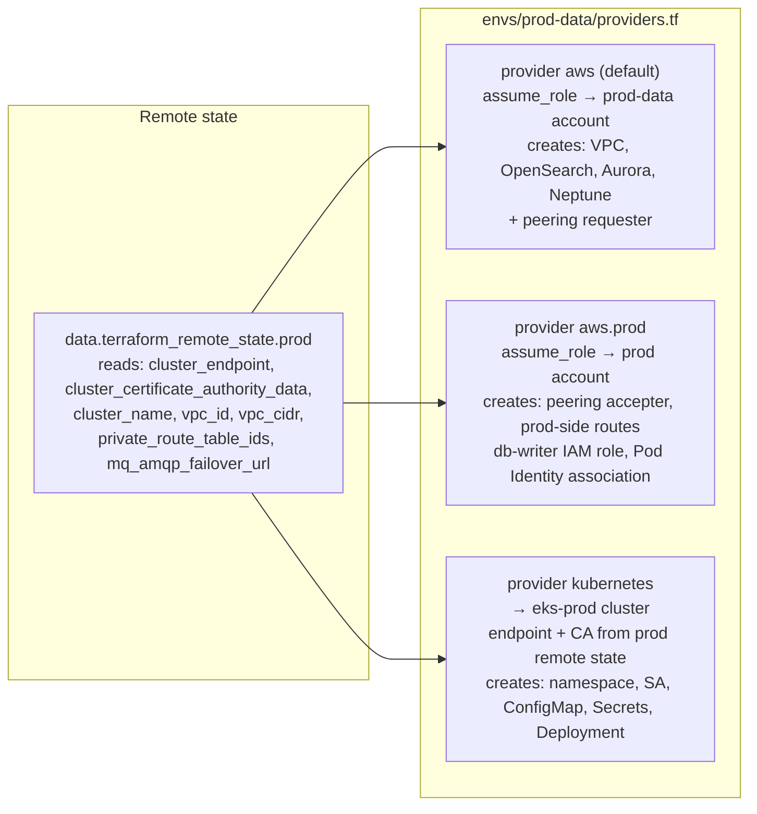

### db-writer microservice data flow

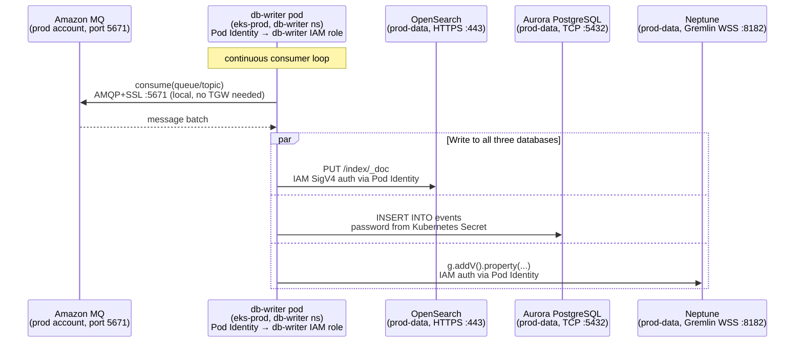

### Key isolation properties

- prod-data VPC (`10.4.0.0/16`) is peered **only** with prod (`10.2.0.0/16`) — no routes to hub, dev, or data
- No Transit Gateway attachment for prod-data — peering is point-to-point, preventing accidental cross-account access
- The `envs/prod-data` workspace manages **all** integration resources (peering, IAM role, Pod Identity, Kubernetes objects) so `terraform destroy` cleanly removes everything without touching the prod workspace

---

## Checkpoint files

Each orchestration script writes a checkpoint file to the repo root so that a failed run can be resumed without repeating completed steps.

| Script | Checkpoint file | Steps |
|---|---|---|
| `startup.sh` | `.startup-progress` | prereqs → bootstrap → accounts → wait_iam → spokes → hub → kubeconfig |
| `apply-all.sh` | `.apply-all-progress` | accounts → spokes → hub |
| `teardown.sh` | `.teardown-progress` | hub → spokes → accounts |
| `shutdown.sh` | `.shutdown-progress` | hub → spokes → accounts → bootstrap |

All four checkpoint files are listed in `.gitignore`.
