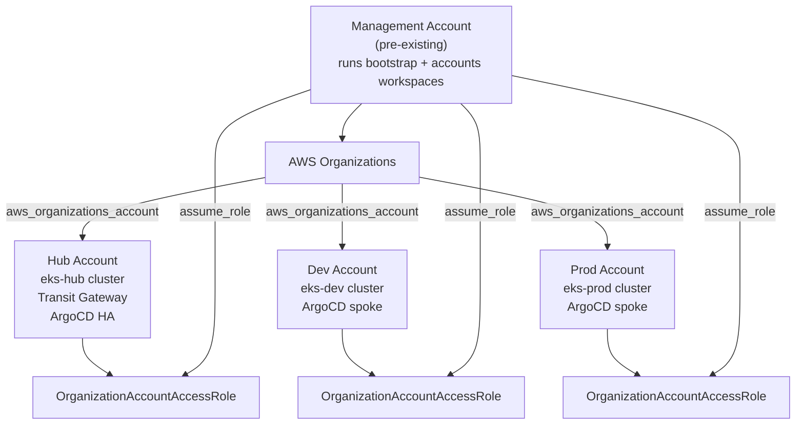
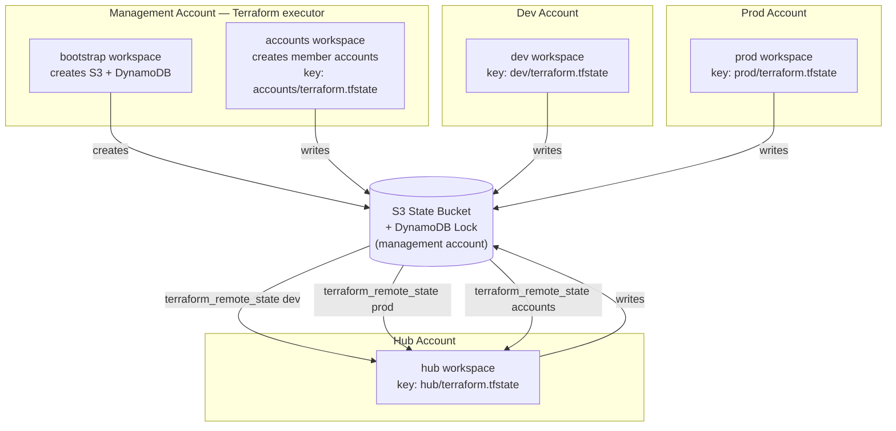
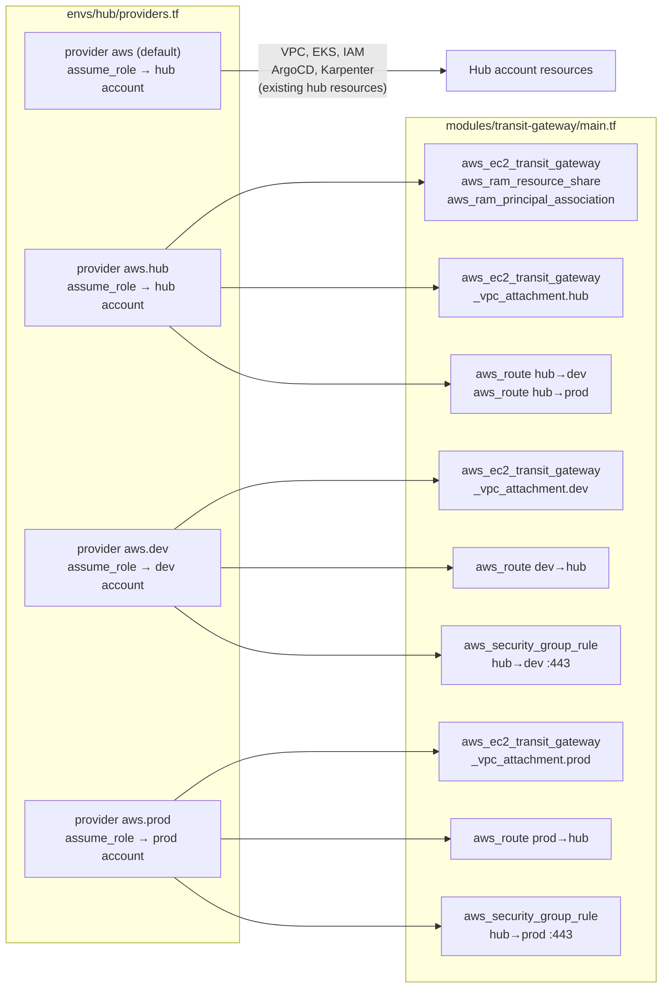
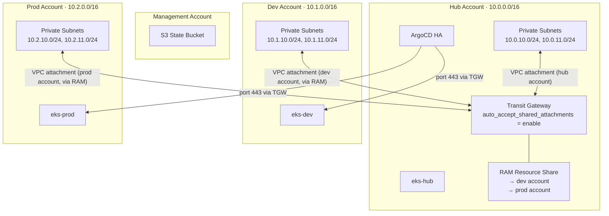
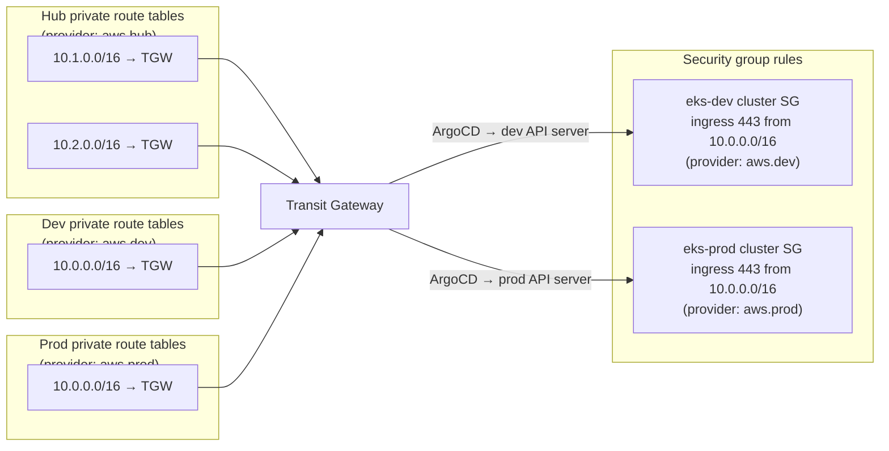
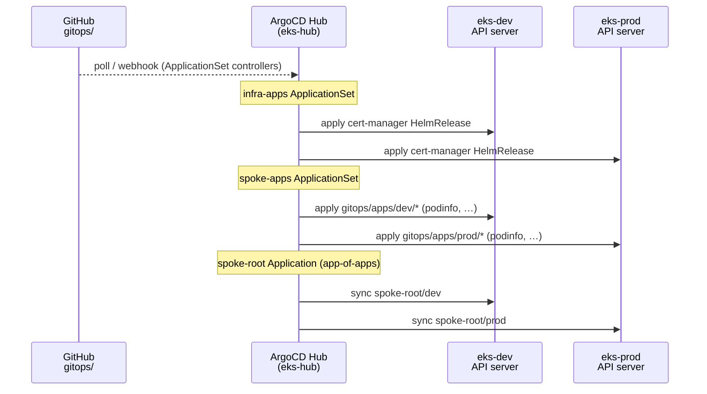
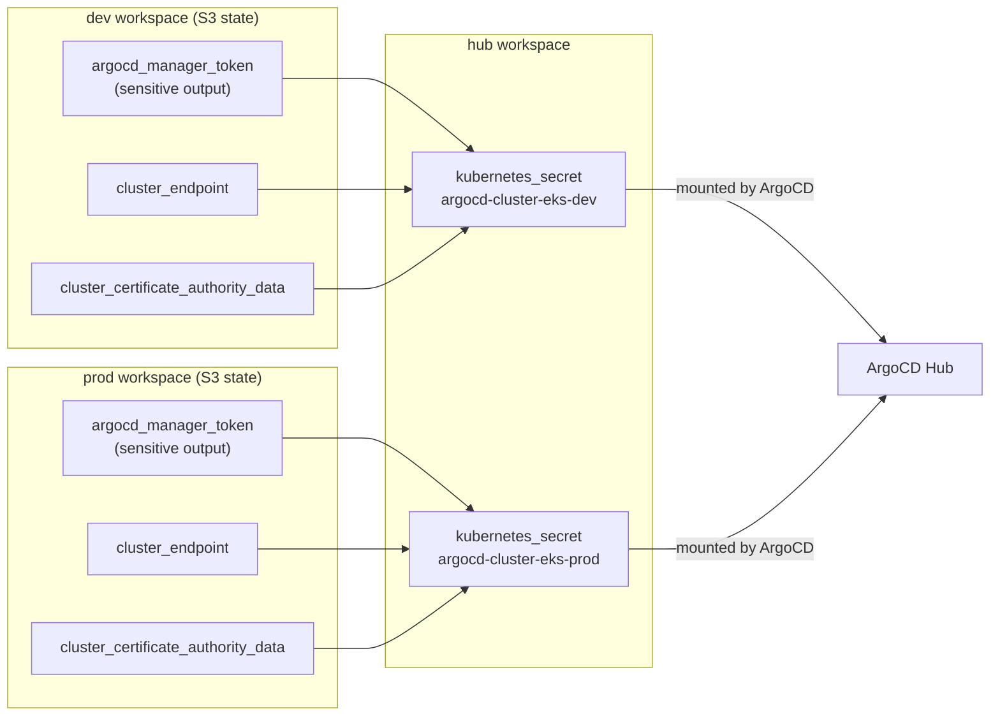
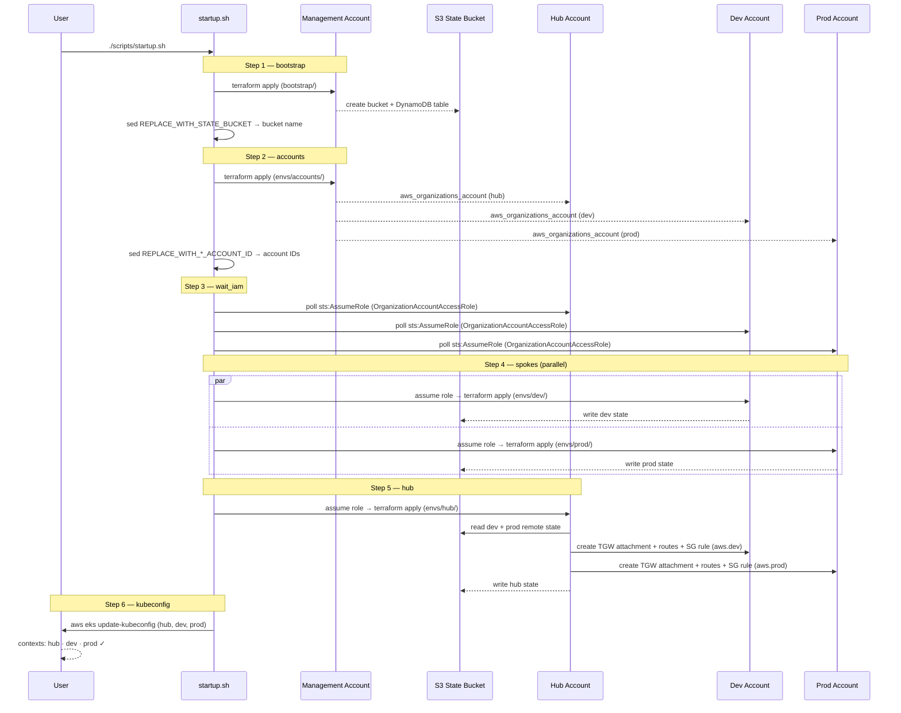

# Low-Level Design — eks-hub-spoke

This document describes the internal architecture of the eks-hub-spoke platform: how the AWS accounts relate to each other, how Terraform state and providers flow between workspaces, how the network is wired together, and how ArgoCD delivers workloads to the spoke clusters.

---

## Table of Contents

1. [AWS Account Hierarchy](#1-aws-account-hierarchy)
2. [Terraform Workspace & State Flow](#2-terraform-workspace--state-flow)
3. [Cross-Account Provider Wiring](#3-cross-account-provider-wiring)
4. [Network Topology](#4-network-topology)
5. [Transit Gateway Routing](#5-transit-gateway-routing)
6. [ArgoCD GitOps Flow](#6-argocd-gitops-flow)
7. [Startup Sequence](#7-startup-sequence)

---

## 1. AWS Account Hierarchy

The management account owns the AWS Organizations root. Three member accounts are provisioned by Terraform — one per cluster. The `OrganizationAccountAccessRole` is created automatically by Organizations in every new member account and is the single mechanism used for all cross-account access.



---

## 2. Terraform Workspace & State Flow

All workspaces share a single S3 bucket (in the management account) for remote state. The hub workspace reads dev and prod state to obtain VPC and subnet IDs needed by the Transit Gateway module.



### Remote state outputs consumed by hub

| Source workspace | Outputs read by hub |
|---|---|
| `dev` | `vpc_id`, `vpc_cidr`, `private_subnet_ids`, `private_route_table_ids`, `cluster_security_group_id`, `cluster_endpoint`, `cluster_certificate_authority_data`, `argocd_manager_token` |
| `prod` | same set as dev |
| `accounts` | reference only (account IDs come from `var.*_account_id`) |

---

## 3. Cross-Account Provider Wiring

The hub workspace declares four AWS provider instances. The default (unaliased) provider and `aws.hub` both assume a role in the hub account — the default is used by all existing hub resources (VPC, EKS, IAM, ArgoCD), while `aws.hub` is passed explicitly into the transit-gateway module. `aws.dev` and `aws.prod` create resources directly inside the spoke accounts without requiring any Terraform code in those workspaces.



---

## 4. Network Topology

The Transit Gateway lives in the hub account and is shared to the spoke accounts via AWS Resource Access Manager (RAM). Each account attaches its private subnets to the TGW. `auto_accept_shared_attachments = enable` removes the need for a manual acceptance step in the spoke accounts.



---

## 5. Transit Gateway Routing

Six route entries and two security group rules are created by the hub workspace using aliased providers.



### RAM share propagation

A `time_sleep` of 30 s is inserted between the RAM principal associations and the cross-account VPC attachments. RAM is eventually consistent — without this delay the spoke accounts would not yet see the TGW, producing a `TransitGatewayNotFound` error.

```
aws_ram_principal_association.dev
aws_ram_principal_association.prod
        │
        │  time_sleep 30s
        ▼
aws_ec2_transit_gateway_vpc_attachment.dev  (provider: aws.dev)
aws_ec2_transit_gateway_vpc_attachment.prod (provider: aws.prod)
```

---

## 6. ArgoCD GitOps Flow

Hub ArgoCD is configured in HA mode (2 replicas). It holds Kubernetes cluster secrets for each spoke, generated from the `argocd_manager` service account token written to the dev and prod remote state.



### Cluster secret data flow



---

## 7. Startup Sequence

`startup.sh` orchestrates all workspaces in dependency order. Dev and prod are applied in parallel since neither depends on the other.



---

## Checkpoint files

Each orchestration script writes a checkpoint file to the repo root so that a failed run can be resumed without repeating completed steps.

| Script | Checkpoint file | Steps |
|---|---|---|
| `startup.sh` | `.startup-progress` | prereqs → bootstrap → accounts → wait_iam → spokes → hub → kubeconfig |
| `apply-all.sh` | `.apply-all-progress` | accounts → spokes → hub |
| `teardown.sh` | `.teardown-progress` | hub → spokes → accounts |
| `shutdown.sh` | `.shutdown-progress` | hub → spokes → accounts → bootstrap |

All four checkpoint files are listed in `.gitignore`.
